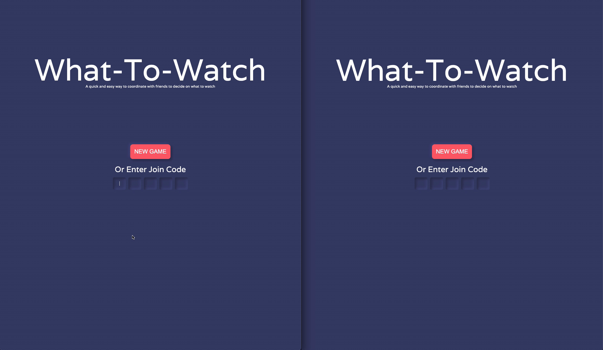
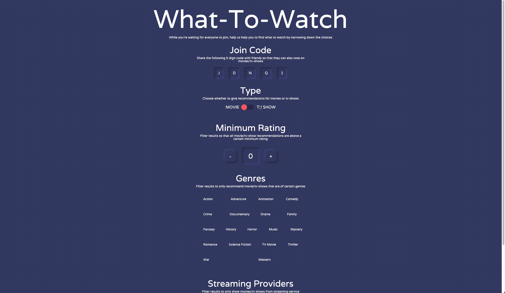

# What-To-Watch [Link](https://whattowatch.martin-petrov.com)

  
  
  
  

## Multiplayer
Once you create a game, share the join code with your friends so that they
can make movie/tv suggestions too

## Filtering

### Streaming Providers
Filter results to only recommend movies/tv shows from certain streaming 
providers such as Netflix, Hulu, Disney+. Apple TV+, and HBO Max

### Genres
Filter results to only recommend certain genres

### Type
Choose whether to give recommendations for movies or tv-shows

### Minimum Rating
Filter results so that all recommendations are above a certain rating
threshold

## Voting

Like or dislike movies. The number of likes/dislikes will be kept track
of, and will be shown in the overview section. WTW will keep suggesting
movies until either it has run out of suggestions, or the users reach a
verbal consensus

## Viewing Cast, Ratings, and Reviews

Need more info before voting on a certain movie/tv-show? Click the card to
see information on the cast, the overall audience rating, and even reviews

## Overview

Click the overview button to see how many of your friends agreed with your vote
on each movie/tv-show that you've already voted on

# About
I use [TheMovieDb's](https://www.themoviedb.org/) api to grab all data for movies / tv-shows
